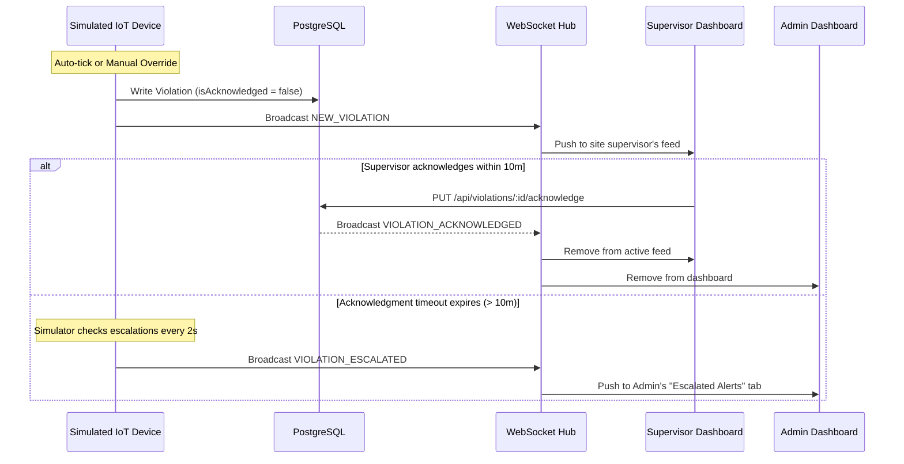

# Project Documentation - ArmourLink

ArmourLink is a full-stack, responsive IoT workforce safety monitoring platform. It is designed to evaluate compliance with Personal Protective Equipment (PPE) guidelines on client job sites.

---

## 🏗️ Architecture Design

The project uses a clean, decoupled client-server architecture:

```
┌────────────────────────────────┐
│      React Web Application     │
│       (Vite + TypeScript)      │
└──────────────┬───▲─────────────┘
               │   │
     REST HTTP │   │ WebSocket Events
               │   │
┌──────────────▼───┴─────────────┐
│       Node/Express API         │
│         (TypeScript)           │
└──────────────┬─────────────────┘
               │
    Prisma ORM │ (PostgreSQL)
               ▼
┌────────────────────────────────┐
│      PostgreSQL Database       │
└────────────────────────────────┘
```

### 1. Backend Server
- **Core Engine**: Built using Node.js, Express, and TypeScript.
- **ORM & Data Layer**: Prisma ORM with a PostgreSQL relational structure. Handles automatic migrations and seeds standard reference data.
- **State & Simulation**: Background timer services run simulated IoT events and maintain an in-memory tracker to manage escalation windows.
- **WebSocket Gateway**: Integrates the standard Node `ws` library to bind a real-time event pipeline on the Express server.

### 2. Frontend Client
- **Stack**: React (v19) powered by Vite and TypeScript.
- **Theme**: Premium Dark Glassmorphism.
- **Global Contexts**:
  - `AuthContext`: Maintains active login tokens (`jsonwebtoken` validation) and profile sessions.
  - `ViolationContext`: Initiates a WebSocket subscription on login and exposes active alerts tables. It automatically updates local lists on incoming WebSocket events (`NEW_VIOLATION`, `VIOLATION_ACKNOWLEDGED`, `VIOLATION_ESCALATED`).

---

## ⚙️ Core System Workflows

### 1. Authentication and Authorization Workflow
1. User logs in with email and password via `/api/auth/login`.
2. Password is verified using `bcryptjs` hashing.
3. Server signs a secure JWT containing the user's ID, role, and assigned `siteId` (for supervisors).
4. Clients supply this token in the `Authorization: Bearer <token>` header.
5. Express middlewares inspect the JWT signature and evaluate role access controls (`requireRole`).

### 2. IoT Telemetry and Escalation Pipeline



1. **Generation**: The background `SimulatorService` picks a random worker (or a specific worker if manually triggered) and records a safety violation (e.g. missing helmet).
2. **Notification**: The event is broadcast via WebSockets. The WebSocket service inspects client scopes:
   - Site Supervisors only receive alerts matching their `siteId`.
   - System Administrators receive all alerts.
3. **Escalation**: The simulator runs an internal loop checking for violations where `isAcknowledged = false`. If the duration since `timestamp` exceeds the threshold, the backend broadcasts a `VIOLATION_ESCALATED` event, instantly pushing the item into the Administrator's Alerts Queue.
4. **Resolution**: When a supervisor clicks "Acknowledge", the backend updates the database (`isAcknowledged: true`, `acknowledgedById: user.id`), clears it from the simulation escalations tracker, and broadcasts a `VIOLATION_ACKNOWLEDGED` event to clear it from all dashboard feeds.
